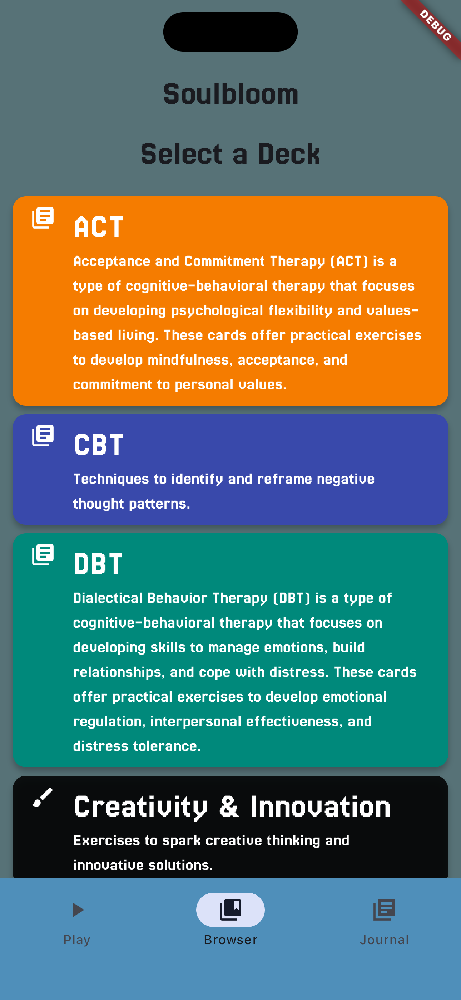

# Soulbloom

Soulbloom is a cross-platform app that has decks of prompt and action cards
to help you reflect and grow.

| Start | Deck List | Card Browser |
|-------|---------|----------|
|  |  |  |

## Overview

There are six decks of cards in Soulbloom:

1. Cognitive Behavior Therapy
2. Dialectical Behavior Therapy
3. Acceptance and Commitment Therapy
4. Rest & Recharge
5. Motivation & Movement
6. Creativity

### Codebase

The application is written entirely in Dart using Flutter with Material widgets.
To manage deck state, the app currently uses `provider` but is in the process of migrating to `riverpod`.

Card data is currently stored in the `assets/data` directory as a collection of
`yaml` files and is loaded into the app's state on startup.

## TODO

- [ ] Migrate from `provider` to `riverpod`
- [ ] Add additional settings
- [ ] Set up persistence model
    - See [cookbook](https://flutter.dev/docs/cookbook/persistence/sqlite) for more information
- [ ] Scaffold `sqflite` implementation
- [ ] Add custom deck creation

### Ideas

- [ ] Conversation starters
    - [ ] Family
    - [ ] Friends
    - [ ] Partners

## Resources

- [Color Scheme](https://lospec.com/palette-list/apollo): Apollo
- [Inspiration](https://theherosjournal.co/pages/sqd-lander):
    - The Hero's Journal SideQuest Decks
    - [Itch.io](https://itch.io/): For pixel art assets
- [Free Music Archive](https://freemusicarchive.org/): For background music

## License

This project is licensed under the MIT License - see the [LICENSE](LICENSE) file for details.

Made by [Stormlight Labs](https://stormlightlabs.org)
